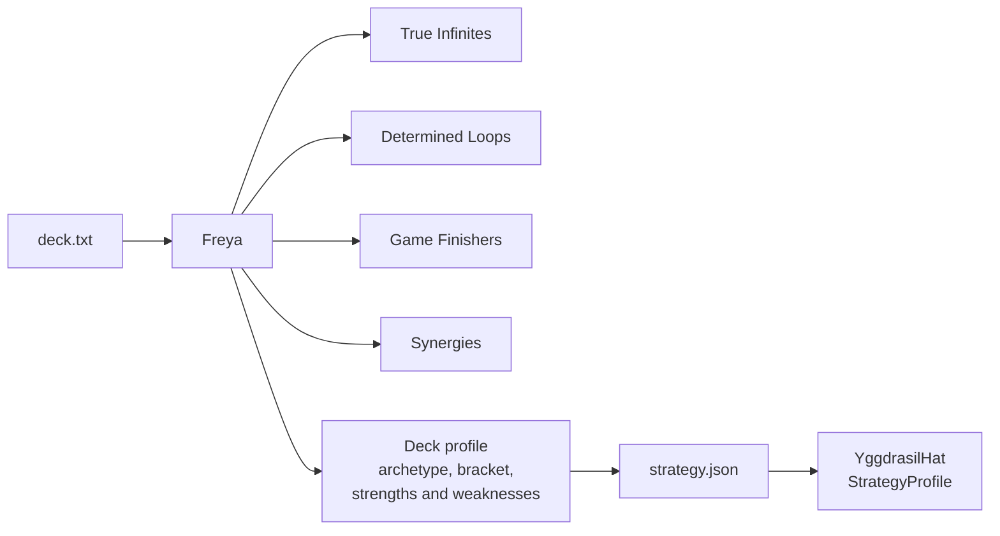

# Tool - Freya

> Source: `cmd/mtgsquad-freya/`

Combo and synergy detector. Reads a decklist, classifies every card's effects, builds a resource graph, finds combos and synergies, classifies the deck's archetype, and writes a `strategy.json` consumed by [YggdrasilHat](YggdrasilHat.md).

This page is the at-a-glance tool reference. For the full algorithm walkthrough, false-positive history, and JSON schema, see [Freya Strategy Analyzer](Freya%20Strategy%20Analyzer.md).

## At a Glance



## What You Get

For a single deck, Freya produces:

- **4 categories** of detected interactions: True Infinites (red), Determined Loops (green), Finishers (yellow), Synergies (blue)
- **Statistics** — mana curve, color demand vs supply, Frank Karsten land evaluation
- **Roles** — 12 tags per card (Ramp, Draw, Removal, BoardWipe, Counterspell, Tutor, Threat, Combo, Protection, Stax, Utility, Land)
- **Archetype** — 10-archetype Euclidean match plus hybrid detection (Reanimator-Combo, Voltron-Stax, etc.)
- **Bracket** — power level 1-5
- **Win lines** — structured plans with tutor support, redundancy, single points of failure
- **Gameplan summary** — one-line narrative
- **Eval weights** — deck-specific overrides for the 8-dim AI evaluator

## Outputs

Three formats via `--format`:

| Flag | Output |
|---|---|
| `--format text` (default) | Human-readable summary on stdout |
| `--format markdown` | Markdown report on stdout |
| `--format json` | Machine-readable JSON on stdout |

Plus, regardless of `--format`:

- `<deck>.strategy.json` written to a `freya/` subfolder next to the deck file — consumed by hats
- `<deck>_freya.md` markdown summary

## Usage

```bash
# Single deck, default text output
go run ./cmd/mtgsquad-freya --deck data/decks/benched/ragost.txt

# Whole directory of decks, markdown
go run ./cmd/mtgsquad-freya --all-decks data/decks/lyon/ --format markdown

# Single deck, JSON to file
go run ./cmd/mtgsquad-freya --deck my_deck.txt --format json > strategy.json
```

## Sample Run Output

For Sin, Special Agent (a Reanimator-Combo deck):

```
=== Sin, Special Agent — Freya Analysis ===
Archetype: Reanimator (secondary: Combo)
Bracket: 4/5 (optimized)

🔴 True Infinites (1):
  - Worldgorger Dragon + Animate Dead — infinite mana

🟢 Determined Loops (2):
  - Bridge from Below + Carrion Feeder — token spam (terminates at deck size)
  - Hermit Druid mill — single-shot self-mill

🟡 Game Finishers (2):
  - Living Death — mass reanimation finisher
  - Razaketh activation chain — tutor-and-sac kill

🔵 Synergies (8):
  - Sin + Carrion Feeder — sacrifice payoff
  - Bone Miser + dredge — discard payoff
  - ...

Mana curve: avg CMC 2.8 (midrange)
Tutors: 9 (high)
Removal: 6
Draw: 12

Gameplan: Reanimator-Combo deck that wins via Worldgorger Dragon + Animate Dead
infinite mana. 2 backup lines available. Supported by 9 tutors. Plays at bracket
4/5 (optimized).
```

## Pipeline (5 Phases)

See [Freya Strategy Analyzer](Freya%20Strategy%20Analyzer.md) for full detail. Quick summary:

1. **Statistics** — mana curve, color sources, Karsten land eval
2. **Roles** — 12 tags per card, multi-role assignment, balance warnings
3. **Archetype** — 10-archetype Euclidean match, hybrid detection
4. **Win lines** — tutor chains, redundancy, single points of failure
5. **Profile** — unified `DeckProfile` struct

## Known Bugs

False-positive loops in the combo detector. Audit found ~20 of 28 detected loops in 7174n1c's decks were false positives. Causes:

- Self-exile not modeled
- Hand vs battlefield destination confusion
- Attack-trigger dependency missed
- Randomness treated as deterministic

See [Freya Strategy Analyzer](Freya%20Strategy%20Analyzer.md) for the full false-positive analysis. Until those are fully fixed, **combo/loop counts in Freya reports should be treated as upper bounds, not exact counts.** The statistics, roles, archetype, and mana modules are accurate.

## When You'd Use Freya

- **Before a tournament** — generate `strategy.json` for every deck the tournament runner will load
- **Deck review** — read the gameplan summary and category breakdown for human eyes
- **AI debugging** — when [YggdrasilHat](YggdrasilHat.md) plays badly, check the strategy file to see if Freya correctly identified the deck

## Related

- [Freya Strategy Analyzer](Freya%20Strategy%20Analyzer.md) — full deep dive
- [Hat AI System](Hat%20AI%20System.md) — strategy injection contract
- [YggdrasilHat](YggdrasilHat.md) — primary consumer
- [Tool - Heimdall](Tool%20-%20Heimdall.md) — analytics that also reads Freya output
