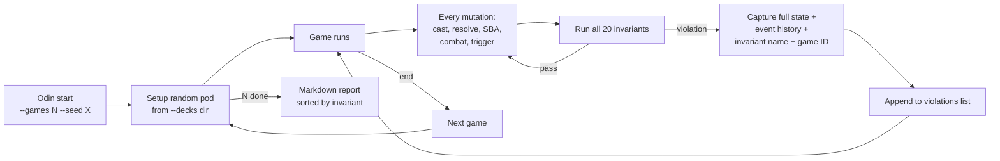

# Tool - Odin

> Source: `cmd/mtgsquad-odin/` (binary), `internal/gameengine/invariants.go` (predicates)

Property-based fuzzer. Wraps every `GameState` mutation with the 20 [Odin invariants](Invariants%20Odin.md). Designed to run overnight on DARKSTAR and produce a markdown report sorted by invariant for next-morning triage.

## Why a Separate Binary

[Loki](Tool%20-%20Loki.md) runs invariants too, but Odin's specialty is **overnight fuzz runs**. Its violation aggregator collects per-game evidence and writes a clean markdown report at the end. The workflow is:

1. Kick off `mtgsquad-odin --games 50000 --workers 32` before bed
2. Wake up to a sorted-by-invariant report listing every violation
3. Triage each violation: which card combination, which action sequence, which invariant
4. Fix the underlying bug
5. Re-run overnight to verify

[Loki](Tool%20-%20Loki.md) doesn't aggregate this way — it logs violations as it sees them, but doesn't sort or summarize at the end. Odin and Loki share the predicate code (single source of truth), differ only in test driver and reporting.

## Fuzz Loop



## Predicate Source

The 20 predicates live in `internal/gameengine/invariants.go` and are documented in [Invariants Odin](Invariants%20Odin.md). Both Odin and [Loki](Tool%20-%20Loki.md) import the same predicate set — single source of truth. When a new invariant is added, it's automatically picked up by both tools.

## Usage

```bash
# Standard overnight run
go run ./cmd/mtgsquad-odin \
  --games 10000 \
  --seed 42 \
  --decks data/decks/cage_match/ \
  --report data/rules/FUZZ_REPORT.md

# Reproduce a specific seed (useful for debugging)
go run ./cmd/mtgsquad-odin \
  --games 1 \
  --seed 12345 \
  --decks data/decks/cage_match/ \
  --verbose
```

## Output Format

The report groups violations by invariant, then by frequency:

```
## ZoneConservation (3 violations)

### Game 47, Turn 12, Action: ResolveStackTop
- Decks: Sin / Yuriko / Tergrid / Coram
- Action sequence: cast Hermit Druid → activate ability → mill 99
- State: 1 card missing from total count
- Repro seed: 47

### Game 1234, Turn 8, Action: DestroyPermanent
- ...
```

Useful because most invariants fail in clusters (one card-pattern violates the same invariant across many games).

## When You'd Use Odin

- **Overnight CI runs** — every push to main triggers an Odin sweep
- **Pre-release validation** — before a tag, run a 50K-game Odin against the full deck pool
- **Investigating a specific class of bug** — `--invariants ZoneConservation` would (if implemented as filter) restrict to a single check

## Related

- [Invariants Odin](Invariants%20Odin.md) — the 20 predicates
- [Tool - Loki](Tool%20-%20Loki.md) — chaos-game counterpart
- [Tool - Thor](Tool%20-%20Thor.md) — exhaustive per-card
