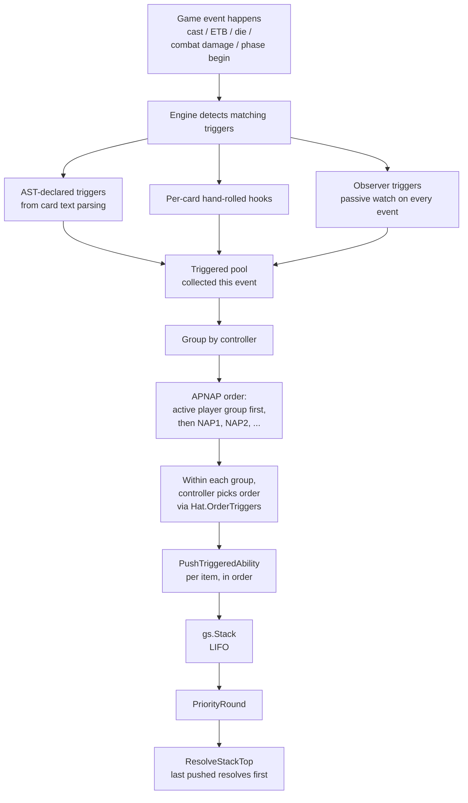
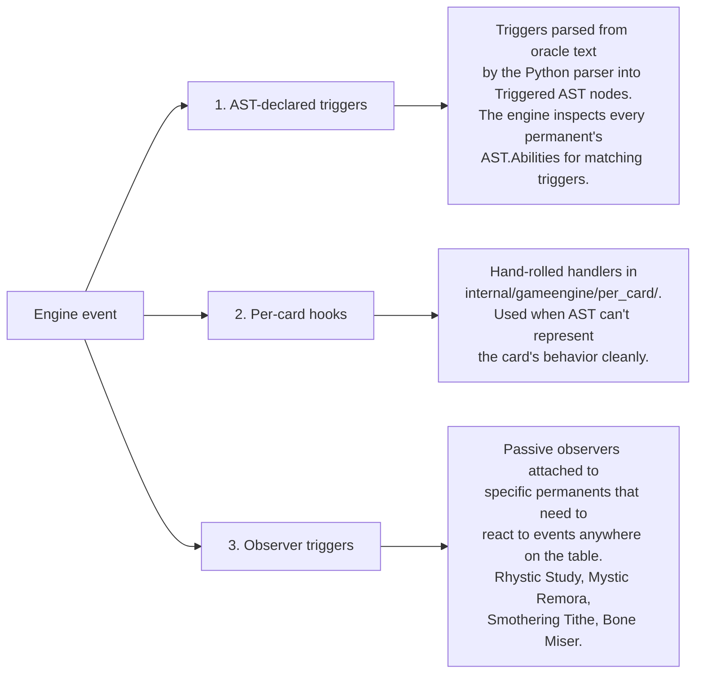

# Trigger Dispatch

> Source: `internal/gameengine/triggers.go`, `trigger_stack_bridge.go`, `observer_triggers.go`, `event_aliases.go`
> CR refs: §603 (triggered abilities), §101.4 (APNAP)

A triggered ability fires when a specific game event happens — *"when this enters the battlefield"*, *"whenever a creature dies"*, *"at the beginning of your upkeep"*. The engine has to detect every event that could match a trigger, find every matching trigger across the table, and put them all on the stack in the correct order.

This page covers the detection, ordering, and dispatch machinery, plus the safety caps that prevent trigger storms from spinning forever.

## Table of Contents

- [What Counts as a Trigger](#what-counts-as-a-trigger)
- [The Trigger Lifecycle](#the-trigger-lifecycle)
- [Three Trigger Sources](#three-trigger-sources)
- [APNAP Ordering](#apnap-ordering)
- [Trigger Guards](#trigger-guards)
- [Event Aliases](#event-aliases)
- [Event Categories](#event-categories)
- [The Per-Card Hook Bridge](#the-per-card-hook-bridge)
- [The 8 Dead-Trigger Fixes (2026-04 Audit)](#the-8-dead-trigger-fixes-2026-04-audit)
- [Loop Shortcut Interplay](#loop-shortcut-interplay)
- [Related Docs](#related-docs)

## What Counts as a Trigger

Per CR §603, a triggered ability is any ability whose oracle text starts with **when**, **whenever**, or **at**. Some examples:

- *"When this creature dies, draw a card."* (event-based)
- *"Whenever you cast a noncreature spell, put a +1/+1 counter on this."* (event-based with frequency)
- *"At the beginning of your upkeep, you may pay {1}."* (phase-based)

Triggered abilities are **distinct from**:

- **Static abilities** (continuous effects, no event needed) — e.g. "Flying", "Lifelink", "Creatures you control get +1/+1"
- **Activated abilities** (player decides to activate) — e.g. "{T}: Add {G}"
- **Replacement effects** (modify the event before it happens) — e.g. "If a creature would die, exile it instead". See [Replacement Effects](Replacement%20Effects.md).

Triggered abilities go on the stack. Replacement effects don't.

## The Trigger Lifecycle



Per §603.3, triggered abilities don't go on the stack the moment they fire — they wait in a pending bucket until the next time priority is about to open. HexDek mostly pushes inline (single-threaded engine, well-defined event sites), but the contract is: between an event firing and priority opening, every matching trigger gets pushed.

## Three Trigger Sources



### 1. AST-Declared Triggers

When the parser produces a `Triggered` AST node for a card's oracle text, the engine knows the trigger event slug, the actor/target filter, and the effect leaf. At event time, the engine walks every permanent's AST and matches triggers against the event.

This handles the bulk of vanilla "when this dies, do X" patterns.

### 2. Per-Card Hooks

For cards whose triggers can't be expressed cleanly in AST form, hand-rolled handlers register via `per_card/registry.go`. See [Per-Card Handlers](Per-Card%20Handlers.md). Examples:

- Doomsday — bespoke 5-pile UI
- Tergrid, God of Fright — discard/sacrifice trigger with permanent restriction
- The One Ring — multi-trigger handling with anti-life-loss

The dispatcher calls `FireCardTrigger(gs, eventName, ctx)` at every event site. Per-card handlers registered for that event name run.

### 3. Observer Triggers

Observers (`observer_triggers.go`) are passive watchers attached to specific permanents. Used when a card needs to react to events that happen *anywhere on the table*, not just to its controller.

Examples:

- **Rhystic Study** — observes every spell cast by every player
- **Mystic Remora** — observes every noncreature spell cast
- **Smothering Tithe** — observes every opponent's draw
- **Bone Miser** — observes every discard

When an observed event fires, the engine walks each seat's battlefield for permanents with matching observers, fires the observer's effect.

## APNAP Ordering

Per CR §603.3b, when multiple triggers fire simultaneously, they're grouped by controller and ordered by [APNAP](APNAP.md):

1. Active player's triggers go on the stack first
2. Then NAP 1's triggers
3. Then NAP 2's triggers
4. ...

**Counterintuitive consequence of LIFO:** the *first* group pushed resolves *last*. So in a 4-player game where all 4 players have a death-trigger creature on the field and a board wipe kills everything, the resolution order is:

- Active player's death triggers pushed first → resolve last
- NAP 1's pushed second → resolve third
- NAP 2's pushed third → resolve second
- NAP 3 (last NAP)'s pushed fourth → resolve first

So the last player in APNAP order "wins the speed race" on simultaneous triggers.

Within each controller's group, the controller picks the order via `Hat.OrderTriggers`. This matters when one player has multiple triggering creatures and wants to sequence their death triggers in a specific order.

## Trigger Guards

Per `per_card/registry.go:fireTrigger`:

- **Per-chain depth: 8** — recursion through trigger handlers caps at 8
- **Total per game: 2000** — cumulative trigger fire count

Why these caps?

**Per-chain depth.** Some cards trigger off events that themselves trigger more events. Without a depth cap, a self-referential trigger chain (e.g. a creature that triggers off "another creature dying" plus a sacrifice outlet plus a "when something is sacrificed" trigger) could recurse forever.

**Total per game.** Some legal Magic configurations produce *thousands* of triggers per turn. Sliver Queen + Goblin Sharpshooter + Sliver Hivelord can produce a state where every untap → every Sliver Queen tap → every Goblin Sharpshooter trigger fires. The 2000 cap catches these; if hit, the engine logs an `infinite_loop_draw` and ends the game.

Memory note (`project_hexdek_parser.md`): the per-chain cap was reduced from 15 to 8 in v10d after the trigger dispatch audit. Both caps are conservative; in 50K production games, the per-chain cap is observed but the per-game total cap is rarely hit (loop shortcut catches most repeating patterns first).

## Event Aliases

`event_aliases.go` normalizes event names. Multiple historical names exist for the same conceptual event:

| Canonical | Aliases |
|---|---|
| `dies` | `creature_died`, `creature_dies`, `permanent_died` |
| `leaves_battlefield` | `permanent_ltb`, `ltb`, `leaves_play` |
| `discard` | `card_discarded` |
| `enters_battlefield` | `permanent_etb`, `etb` |
| `cast` | `spell_cast` |

A handler can register for any alias; the dispatcher normalizes both registration and event-firing names to the canonical form before matching.

This was retrofitted after the 2026-04 audit found 8 dead per-card triggers because of name mismatches. Without aliases, a handler registered for `creature_died` would silently never fire when the engine emitted `dies`.

## Event Categories

The full event vocabulary, organized:

| Category | Events | Notes |
|---|---|---|
| Zone changes | `enters_battlefield`, `leaves_battlefield`, `dies`, `exiled`, `discarded`, `milled`, `returned`, `tucked` | See [Zone Changes](Zone%20Changes.md) |
| Cast | `cast`, `noncreature_spell_cast`, `creature_spell_cast`, `opponent_cast` | Rhystic Study, Mystic Remora |
| Combat | `attacks`, `blocks`, `deals_damage`, `deals_combat_damage_to_player` | |
| Phases | `upkeep`, `upkeep_controller`, `draw_step`, `end_step`, `combat_begin` | `upkeep_controller` per-card since 2026-04-26 |
| Counters | `counter_added`, `counter_removed` | |
| Sacrifice | `artifact_sacrificed`, `creature_sacrificed`, `food_sacrificed`, `permanent_sacrificed` | Subject-typed |
| Targeting | `became_target` | Stub — no targeting hook yet |
| Life | `life_gained`, `life_lost`, `life_change` | `life_change` not currently emitted (Exquisite Blood gap) |
| Saga | `lore_counter_added` | Stub — Urza's Saga gap |

The "Stub" rows are known dead-trigger paths flagged in `project_hexdek_trigger_audit.md`. Phantasmal Image, Exquisite Blood, and Urza's Saga need engine hooks that don't currently exist.

## The Per-Card Hook Bridge

`per_card_hooks.go` exposes:

```go
type TriggerHook func(gs *GameState, ctx *TriggerContext)

func RegisterTriggerHook(eventName string, sourceCardName string, hook TriggerHook)
func HasTriggerHook(eventName, cardName string) bool
func FireCardTrigger(gs *GameState, eventName string, ctx *TriggerContext)
```

Per-card subpackage registers via package `init()` functions. The engine calls `FireCardTrigger` at every relevant event site. The cycle-avoidance trick: the per-card subpackage imports the engine, but the engine uses a function-pointer registry rather than importing the subpackage.

Source pattern at every event site:

```go
// In zone_change.go after a creature dies
gs.LogEvent(Event{Kind: "dies", Source: card.Name, ...})
FireCardTrigger(gs, "dies", &TriggerContext{Source: perm, ...})
```

## The 8 Dead-Trigger Fixes (2026-04 Audit)

Memory: `project_hexdek_trigger_audit.md`. The audit found 8 per-card handlers that were registered with the wrong event name and never fired:

| Card | Wrong name | Correct name |
|---|---|---|
| Ragavan, Nimble Pilferer | `attack` | `attacks` |
| Sword of Feast and Famine | `combat_damage` | `deals_combat_damage_to_player` |
| Eye of Vecna | `upkeep` | `upkeep_controller` |
| Oppression | `cast_creature` | `creature_spell_cast` |
| Hand of Vecna | `combat_damage_player` | `deals_combat_damage_to_player` |
| Sylvan Library | `draw` | (multiple draws not summed correctly) |
| Book of Vile Darkness | `upkeep` | `upkeep_controller` |
| Necrogen Mists | `upkeep` | `upkeep_controller` |

Fix wave:

1. Patch each handler's registration to use the canonical name.
2. Add `event_aliases.go` so future mismatches normalize automatically.
3. Add the missing `upkeep_controller` event firing in `turn.go` (it had been omitted entirely — the engine's `FirePhaseTriggers` only iterated AST abilities, not per-card hooks).

The `upkeep_controller` fix alone re-enabled triggers on Mana Crypt, Eye of Vecna, The One Ring, Mystic Remora, Oloro, Necrogen Mists, and Bottomless Pit. A silent failure affecting 7+ active cards.

## Loop Shortcut Interplay

When a trigger pattern repeats — Kinnan-tap-untap, Ashling-counter-pump, Worldgorger-Animate-Dead recursion — `loop_shortcut.go` (see [Stack and Priority](Stack%20and%20Priority.md)) detects the repetition by fingerprinting stack entries and projects per-cycle deltas forward in one shot.

This means trigger-loop patterns hit the `maxStackDrainIterations = 500` cap rarely; they're caught by the loop shortcut around iteration ~12 and projected forward. The trigger guards (8 / 2000) are the second line of defense for cases the loop shortcut can't fingerprint.

## Related Docs

- [Stack and Priority](Stack%20and%20Priority.md) — where triggers go after dispatch
- [Zone Changes](Zone%20Changes.md) — major source of zone-change triggers
- [Per-Card Handlers](Per-Card%20Handlers.md) — when AST can't express a card
- [Replacement Effects](Replacement%20Effects.md) — the other event-routing system
- [APNAP](APNAP.md) — multiplayer ordering
- [Hat AI System](Hat%20AI%20System.md) — `OrderTriggers` decision
