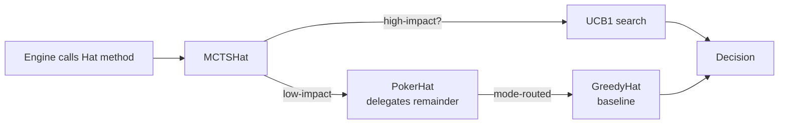
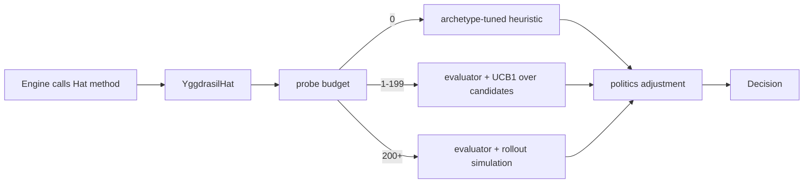
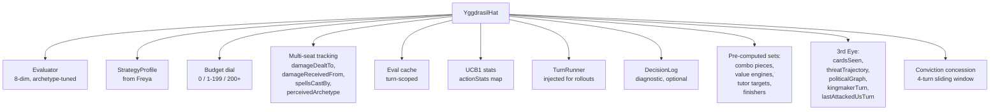
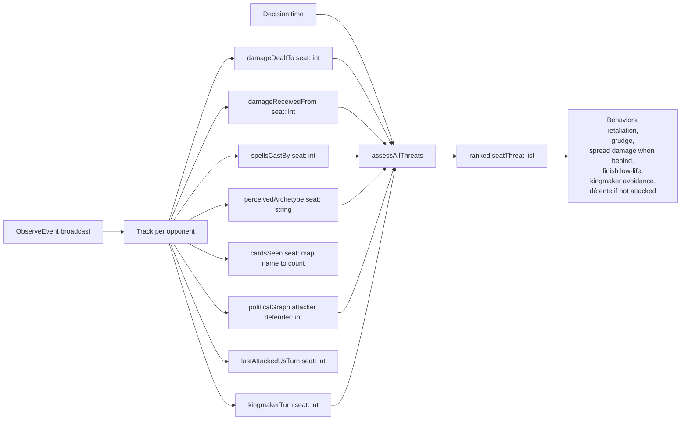

# YggdrasilHat

> Source: `internal/hat/yggdrasil.go` (3342 lines)
> Status: **Current** — standard for all tournament play

YggdrasilHat is HexDek's production AI. One brain, one struct, every decision flows through the same evaluation pipeline. Replaces the Greedy → Poker → MCTS delegation chain that came before it.

Named by 7174n1c after Yggdrasil, the Norse World Tree connecting the nine worlds — a single root with branches into every dimension of decision-making.

## Table of Contents

- [What "Unified Brain" Means](#what-unified-brain-means)
- [Composition](#composition)
- [Construction](#construction)
- [The Budget Dial](#the-budget-dial)
- [Decision Pipeline](#decision-pipeline)
- [Multi-Seat Politics Layer](#multi-seat-politics-layer)
- [Where Eval Weights Enter](#where-eval-weights-enter)
- [When Rollouts Kick In](#when-rollouts-kick-in)
- [Eval Cache and Turn Budget](#eval-cache-and-turn-budget)
- [Configuration Knobs](#configuration-knobs)
- [Comparison vs Greedy and Poker](#comparison-vs-greedy-and-poker)
- [Production Stats](#production-stats)
- [Known Ceilings](#known-ceilings)
- [Related Docs](#related-docs)

## What "Unified Brain" Means

The chain pattern looked like this:



Three implementations, two delegation layers. Adding a new method meant updating three structs and figuring out which layer's override fired. Multiplayer politics had no home — Greedy was stateless, Poker was per-seat, MCTS was rollout-only.

Yggdrasil collapses it:



One struct. One pipeline. Politics applies uniformly across all paths. Native multi-seat awareness — `assessAllThreats()` runs every decision and scores every opponent.

## Composition



Every field listed here exists on the actual struct (`yggdrasil.go:26-115`). The "3rd Eye" comment in source describes the omniscient-intelligence subsystem that tracks per-opponent history across the whole game.

## Construction

The standard constructor:

```go
sp, _ := hat.LoadStrategyFromFreya("data/decks/lyon/sin.txt")
seat.Hat = hat.NewYggdrasilHat(sp, /*budget*/ 50)
```

For more control:

```go
seat.Hat = hat.NewYggdrasilHatWithNoise(sp, /*budget*/ 100, /*noise σ*/ 0.2)
```

Tournament runner wires `TurnRunner` separately (so it can break the import cycle between hat and tournament packages):

```go
yh := hat.NewYggdrasilHat(sp, 100)
yh.TurnRunner = tournament.TurnRunnerForRollout()
yh.TurnBudget = 100
```

Construction does:

1. Initializes the evaluator from `StrategyProfile.Weights` if present, else from archetype defaults.
2. Builds O(1) lookup sets from `ComboPieces`, `ValueEngineKeys`, `TutorTargets`, `FinisherCards`. (See `buildLookupSets` at `yggdrasil.go:166-188`.)
3. Allocates the action-stats map for UCB1.
4. Seeds an RNG for noise injection on tied scores.

## The Budget Dial

The single most important configuration knob. Source: `yggdrasil.go:29` and `rollout.go:10-13`.

| Budget | Behavior |
|---|---|
| `0` | **Heuristic mode.** Archetype-tuned rules only. Equivalent to GreedyHat with combo awareness. ~zero allocation per decision. |
| `1-199` | **Evaluator-guided.** For each candidate, score the post-action state with the 8-dim evaluator. Pick highest UCB1. |
| `200+` | **Rollout mode.** Clone the game state, apply the candidate, run 3 turns of forward simulation, evaluate the terminal state. Pick highest. |

The threshold `rolloutBudgetGe = 200` (`rollout.go:12`) is the boundary. Below it, no rollouts happen; above it, every high-impact decision gets simulated forward.

The budget is **personality**, not just speed. Higher budget = deeper search = "better" play, but it's not strictly monotonic — sometimes shallow heuristics outperform shallow rollouts because the rollout's 3-turn horizon is too short to capture the strategic implication of a turn-2 ramp spell.

`--hat-budget 50` is the recommended baseline for tournament runs. `--hat-budget 200` for showmatches.

## Decision Pipeline

Every Hat method follows the same shape:

```mermaid
flowchart TD
    Call[Hat method called] --> Adaptive{Adaptive budget check<br/>battlefield ≥ 60?}
    Adaptive -- yes --> Heur[Force heuristic mode]
    Adaptive -- no --> CheckBudget{Budget = 0?}
    CheckBudget -- yes --> Heur
    CheckBudget -- no --> Single{Only one<br/>candidate?}
    Single -- yes --> One[Return that candidate]
    Single -- no --> CheckTurnBud{TurnBudget<br/>exhausted?}
    CheckTurnBud -- yes --> Heur
    CheckTurnBud -- no --> Eval[Score every candidate<br/>via evaluator]
    Eval --> Roll{Budget ≥ 200<br/>and TurnRunner set?}
    Roll -- yes --> Sim[simulateRollout per candidate<br/>clone + 3 turns + eval]
    Roll -- no --> UCB[UCB1 select<br/>over scores]
    Sim --> UCB
    UCB --> Politics[Apply politics adjustment<br/>retaliation, grudge,<br/>spread damage when behind]
    Heur --> Politics
    Politics --> Noise[Add gaussian noise<br/>σ from Noise field]
    Noise --> Pick[Best score]
    Pick --> Record[recordAction<br/>UCB1 stats]
    Pick --> Log[Decision log entry<br/>R{round}.{seat}]
    Pick --> Return[Return decision]
```

A few things worth pulling out:

- **Adaptive budget** (`yggdrasil.go:124`): when the total battlefield count crosses 60 permanents (a developed mid-game across 4 seats), the hat forces itself to heuristic mode for the remainder of the turn. Pathological boards skip the expensive evaluation entirely. This was the fix that made cEDH-density games run in seconds instead of minutes.
- **Turn budget** (`yggdrasil.go:112`): each evaluator-path decision costs 1 point, each rollout costs `rolloutEvalCost = 10`. When the budget for the turn is exhausted, remaining decisions degrade to heuristic. Prevents one turn with 50 priority windows from dominating per-game cost.
- **Noise**: at the very end, gaussian noise (default σ = 0.2) is added to scores. This breaks ties, prevents UCB1 thrashing on equivalent candidates, and produces realistic variance across runs of the same matchup.

## Multi-Seat Politics Layer

This is what Greedy and Poker fundamentally couldn't do. Yggdrasil tracks every opponent natively.



Behaviors that fall out of these tracked dimensions:

- **Retaliation risk** — if I'm about to attack seat 2, what's the chance seat 2 retaliates next turn? `damageReceivedFrom[2]` history informs this.
- **Grudge factor** — keep attacking seats that attacked me first. `lastAttackedUsTurn[]` persists across turns.
- **Spread damage when behind** — when my eval is below average, prefer the play that splits damage across multiple opponents instead of focusing one. Slows down the leader.
- **Finish low-life priority** — when an opponent is at ≤ 5 life and I have lethal, take it regardless of "best long-term play."
- **Kingmaker avoidance** — don't hand the win to a seat that's about to win anyway. `kingmakerTurn[]` flags seats whose evals crossed the win-imminent threshold.
- **Détente** — opponents who haven't attacked us recently get attacked last. `lastAttackedUsTurn[]` decay.

These behaviors didn't exist in Greedy or Poker. They're the difference between "AI that plays Magic correctly" and "AI that plays *multiplayer* Magic correctly."

## Where Eval Weights Enter

The evaluator is constructed once at hat creation and reused for every decision. See [Eval Weights and Archetypes](Eval%20Weights%20and%20Archetypes.md) for the full 8-dimensional scoring.

Two paths feed weights:

1. **`StrategyProfile.Weights` set** (Freya wrote them) → use those directly.
2. **`StrategyProfile.Weights` nil** → look up `DefaultWeightsForArchetype(profile.Archetype)`.

When `StrategyProfile` itself is nil (no Freya analysis), the evaluator gets midrange defaults — generic-but-functional play.

## When Rollouts Kick In

`canRollout()` (`yggdrasil.go` mirroring `mcts.go:19`):

```go
return h.Budget >= 200 && h.TurnRunner != nil
```

Both conditions must hold. Tournament runner injects `TurnRunner` for every Yggdrasil seat, so the question reduces to budget.

A rollout is:

1. Clone the game state with `gs.CloneForRollout(rng)`. Deep clone, fresh RNG per rollout.
2. Apply the candidate action to the clone.
3. Resolve any pushed stack items (simplified resolution — see `rollout.go:resolveStack`).
4. Run 3 turns via the injected `TurnRunner`. Each call advances one full turn including SBAs.
5. Evaluate the terminal state from the original seat's perspective.
6. Return that score as the candidate's value.

Detail in [MCTS and Yggdrasil](MCTS%20and%20Yggdrasil.md).

## Eval Cache and Turn Budget

**Eval cache.** `evalCache map[evalCacheKey]float64` keyed on seat index, invalidated only when the turn changes. The board state doesn't change on stack pushes (the spell hasn't resolved yet), so an evaluation cached on the first decision of a priority round stays valid for every subsequent decision in that round.

This was a major performance win. The eval pass touches every permanent, every card in hand, and every opponent's life — without the cache, a single complex priority round could re-eval 30+ times.

**Turn budget.** `TurnBudget int` (default 0 = unlimited legacy mode). When > 0, each evaluator-path decision costs 1 point and each rollout costs 10. When the per-turn budget hits zero, remaining decisions in that turn degrade to heuristic mode.

Recommended: `--turn-budget 100` for tournament runs. Caps worst-case per-turn cost without compromising decision quality on the high-impact turns.

## Configuration Knobs

| Knob | Field | Default | Effect |
|---|---|---|---|
| Budget | `Budget` | passed at construction | Search depth (0 / 1-199 / 200+) |
| Noise | `Noise` | 0.2 | Gaussian σ on candidate scores |
| TurnBudget | `TurnBudget` | 0 | Per-turn eval point ceiling |
| TurnRunner | `TurnRunner` | nil | Required for rollouts |
| DecisionLog | `DecisionLog` | nil | Diagnostic trace; nil disables |
| Strategy | `Strategy` | nil | Deck-specific profile from Freya |

The `WithBudget` / `WithStrategy` style functional options exist as helpers around the constructor — they all set fields on the same struct. There's no "mode" beyond what these fields configure.

## Comparison vs Greedy and Poker

Synthetic numbers from past tournament runs (memory: `project_hexdek_architecture.md` decision 9):

| Hat | Avg game length (turns) | Win % vs Greedy | Notes |
|---|---|---|---|
| GreedyHat | 14 | 25% (4-seat random) | Baseline. No combo recognition. |
| PokerHat (budget 0) | 13 | ~30% | Threat scoring helps target selection. |
| PokerHat (budget 50) | 13 | ~38% | Evaluator-guided pick. |
| YggdrasilHat (budget 0) | 13 | ~33% | Heuristic + politics + Freya combo awareness. |
| YggdrasilHat (budget 50) | 12 | ~42% | Adds eval-guided pick. |
| YggdrasilHat (budget 200) | 12 | ~46% | Adds 3-turn rollouts. |

Numbers are illustrative; actual run-to-run variance is significant. The qualitative finding: **politics + combo awareness** (the Yggdrasil-budget-0 row) wins more than **search depth alone** (the Poker-budget-50 row). Multi-seat awareness is worth more than additional rollouts.

## Production Stats

50K-game tournament on DARKSTAR (v10d binary, 2026-04-28):

- 1m34s wall-clock
- 532 games/sec sustained
- 2 timeouts (0.004%)
- 654 / 654 unique commanders covered
- 32 workers, lazy pool mode

Top winrate commanders (Yggdrasil at budget 50):

1. Olivia Opulent — 34.3%
2. Zinnia — 34.2%
3. Muldrotha, the Gravetide — 33.5%
4. Shadowheart — 33.1%
5. Elsha of the Infinite — 32.6%

**Pattern observation:** graveyard recursion commanders (Muldrotha, Karador, Extus, Chainer) cluster at the top. Yggdrasil's `GraveyardValue` weighting is correctly recognizing these as resource engines, but the per-card value bumps may be over-weighted relative to other archetypes.

## Known Ceilings

**Combo win conditions.** ~90% of Yggdrasil wins are via combat damage even for combo decks. The engine doesn't currently recognize *assembled* combos as wins — there's no "infinite damage" loop resolution, no mill-deck-out kill, no "you win the game" combo terminator.

Combo decks beat down for the win even when they have a live combo. This is the primary remaining ceiling on combo archetype performance, and it's an engine-side gap (not a hat-side gap). Tracked in memory as `project_hexdek_architecture.md` decision 15.

When combo win-condition resolution lands, expect combo-archetype winrates to jump significantly.

**Other gaps:**

- Mulligan intelligence is generic — doesn't read deck-specific signals about "what's a keepable opener for *this* deck."
- Alliance / betrayal politics is one-step. Multi-turn political reasoning ("if I help seat 2 kill seat 1, will seat 2 then win?") is heuristic, not search.
- Combo execution sequencing is rough. The `comboUrgency()` heuristic prioritizes the "last missing piece" but doesn't always sequence the cast order correctly when multiple legal orderings exist.

## Related Docs

- [Hat AI System](Hat%20AI%20System.md) — interface contract
- [MCTS and Yggdrasil](MCTS%20and%20Yggdrasil.md) — search algorithm details
- [Eval Weights and Archetypes](Eval%20Weights%20and%20Archetypes.md) — 8-dimensional scoring
- [Freya Strategy Analyzer](Freya%20Strategy%20Analyzer.md) — strategy profile producer
- [Tournament Runner](Tournament%20Runner.md) — production deployment
- [Greedy Hat](Greedy%20Hat.md) — deprecated baseline
- [Poker Hat](Poker%20Hat.md) — deprecated experiment
