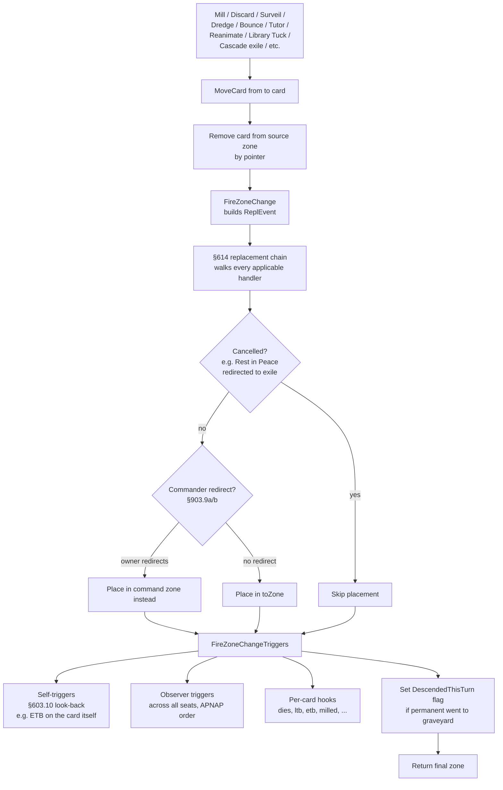
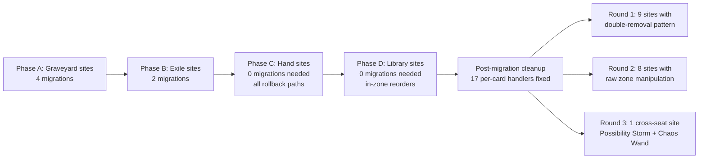

# Zone Changes

> Source: `internal/gameengine/zone_move.go`, `zone_change.go`, `commander.go`
> CR refs: §400 (zones), §603.10 (zone-change look-back), §614 (replacements), §700.4 (zone-change semantics), §701.7 (destroy), §701.17 (sacrifice), §903.9 (commander redirect)

Magic has seven zones: library, hand, battlefield, graveyard, exile, stack, and command zone. Cards move between zones constantly — drawn from library to hand, cast from hand to stack to battlefield, killed from battlefield to graveyard, milled from library to graveyard. **Every** such transition is a zone change, and every zone change must:

1. Run §614 replacement effects (Rest in Peace turning graveyard into exile, Anafenza preventing graveyard placement, etc.)
2. Honor §903.9b commander redirect (commander going anywhere → owner may instead send to command zone)
3. Fire matching triggers (Bone Miser on discard, Sidisi on mill, every "when this dies" trigger)

`MoveCard` is the universal entry point that ensures all three happen. This page explains why it exists, what it does, and how the engine got to this point.

## Table of Contents

- [The Problem MoveCard Solves](#the-problem-movecard-solves)
- [The Universal MoveCard Flow](#the-universal-movecard-flow)
- [Zone-to-Zone Operations](#zone-to-zone-operations)
- [Battlefield Exits Are Different](#battlefield-exits-are-different)
- [Commander Redirect (§903.9a/b)](#commander-redirect-9039ab)
- [Cards Affected by the Migration](#cards-affected-by-the-migration)
- [Migration Phases](#migration-phases)
- [Edge Cases and Skips](#edge-cases-and-skips)
- [The DescendedThisTurn Hook](#the-descendedthisturn-hook)
- [Related Docs](#related-docs)

## The Problem MoveCard Solves

Pre-migration, zone moves were ad hoc. Each effect site implemented zone movement differently:

```go
// Old code, Hermit Druid mill
seat.Library = seat.Library[1:]
seat.Graveyard = append(seat.Graveyard, top)
// missing: replacement check, commander redirect, mill trigger
```

This was silent. If Rest in Peace was on the table, the milled card *should* have been exiled — instead it went to the graveyard. If Sidisi, Brood Tyrant was on the field, mill *should* have triggered her zombie token — instead nothing happened.

The audit (memory: `project_hexdek_zone_change_plan.md`) found **210 raw zone-move call sites** bypassing the replacement chain, commander redirect, and trigger dispatch. Migrating all of them to `MoveCard` was the project.

## The Universal MoveCard Flow



`zone_move.go` is the simple entry point (125 lines). `zone_change.go` (676 lines) does the heavy lifting — `FireZoneChange`, `FireZoneChangeTriggers`, `DestroyPermanent`, `ExilePermanent`, the commander redirect machinery.

## Zone-to-Zone Operations

| Operation | Function | CR | Notes |
|---|---|---|---|
| Destroy permanent (regular) | `DestroyPermanent` | §701.7 | Honors indestructible; shield-counter check first |
| Exile from battlefield | `ExilePermanent` | §406.3 | Bypasses indestructible |
| Sacrifice from battlefield | `sacrificePermanentImpl` | §701.17 | Bypasses indestructible; emits typed sacrifice events |
| Bounce to hand | `BouncePermanent` | §701.10 | Return to hand from battlefield |
| Mill / Discard / Surveil / Dredge | `MoveCard` | §400 | Universal entry for non-battlefield source |
| Tutor / Reanimate / Library tuck | `MoveCard` | §400 | Same |
| Cascade exile / Hideaway exile | `MoveCard` | §400 | Same |

Every non-battlefield source uses `MoveCard`. Only battlefield-exits use the dedicated `Destroy` / `Exile` / `sacrifice` / `Bounce` functions because they have additional cleanup (counter removal, aura detachment, untracking from `Battlefield[]`).

## Battlefield Exits Are Different

Why don't battlefield-to-X exits use `MoveCard`?

A permanent leaving the battlefield needs:

1. Removal from the `[]*Permanent` slice
2. Aura/equipment detachment from this permanent (each gets its own LTB processing)
3. Counter values dropped (counters don't follow the card to graveyard)
4. LTB triggers fired for *this* permanent
5. `Permanent` lifecycle cleanup (zero out runtime flags, etc.)

`MoveCard` handles step 5 (zone-change triggers) but not steps 1-4. The dedicated functions handle all five.

The migration target was specifically: **non-battlefield sources** going *anywhere*. Library → graveyard (mill). Hand → graveyard (discard). Library → exile (cascade). Graveyard → battlefield (reanimate). Etc. These don't have the battlefield-cleanup concerns.

## Commander Redirect (§903.9a/b)

> *"If a commander would be put into a library, hand, graveyard, or exile from anywhere, its owner may put it into the command zone instead."*

When `MoveCard`'s destination is library, hand, graveyard, or exile, and the card is a commander, the engine asks `Hat.ShouldRedirectCommanderZone(gs, seatIdx, commander, to)`. If the hat returns true, the card goes to the command zone instead.

This applies to:

- Commander dies in combat
- Commander destroyed by Wrath
- Commander tucked to library
- Commander bounced to hand
- Commander milled
- Commander exiled

After every redirect, the commander cast tax increments. Memory of how many times a commander was cast lives in `Seat.CommanderCastCounts[name]`.

## Cards Affected by the Migration

Pre-migration, these cards either silently failed or had bespoke per-card workarounds:

| Card | Pre-migration bug | Resolved by |
|---|---|---|
| **Sidisi, Brood Tyrant** | Mill didn't fire her zombie-token trigger | `MoveCard` runs zone-change triggers including `milled` |
| **The Gitrog Monster** | Land-mill draw trigger ignored | Same |
| **Narcomoeba** | Mill-to-battlefield never happened | `MoveCard` fires its replacement-style trigger |
| **Bone Miser** | Discard triggers missed | `MoveCard` fires `discarded` after replacement chain |
| **Dimir Spybug** | Surveil triggers missed | Same for surveil |
| **Opposition Agent** | Opponent search/tutor triggers missed | `MoveCard` runs cross-seat |
| **Tasigur, the Golden Fang** | Delve exile bypassed | Cast-from-hand path also routes through MoveCard |
| Every "descend" card | `DescendedThisTurn` flag never set | `MoveCard` sets it on perm → graveyard |

The migration also fixed a class of "tries to look at zone but card isn't there" bugs — the old pattern of "remove from library, then call MoveCard" caused double-removal when migration was incomplete.

## Migration Phases

Memory: `project_hexdek_zone_change_plan.md` documents the migration as it happened.



**Phase A — Graveyard sites (4 migrations):**

- `stack.go` — countered (§701.5a), fizzled (§608.2b), resolved instant/sorcery (§608.2g)
- `keywords_misc.go` — retrace resolved spell (§702.81)

**Phase B — Exile sites (2 migrations):**

- `stack.go` — flashback/escape exile on resolve (§702.33)
- `resolve.go` — mass graveyard exile (Bojuka Bog pattern) — now per-card MoveCard loop

**Phase C — Hand sites (no migration needed):**

- All 8 sites are rollback paths (failed cost payment returns card to hand)
- Rollback isn't a "real" zone change in the CR sense — it's undoing a state we never entered

**Phase D — Library sites (no migration needed):**

- All sites are in-zone reorders (fateseal, tutor-to-top, discover shuffle-back) or already use `MoveCard` (hideaway exile, discover-to-hand)
- Fetch lands: library removal is raw but destination is battlefield via `enterBattlefieldWithETB` (correct lifecycle)

**Post-migration cleanup (2 audit rounds, 2026-04-27):**

- Round 1 (9 fixes): ad_nauseam, bolass_citadel, emry, hermit_druid, demonic_consultation, commanders_batch ×2, yuriko, chains_of_mephistopheles — all did `s.Library = s.Library[1:]` *before* MoveCard (double-removal)
- Round 2 (8 fixes): batch17_sweep cards (Howling Mine, Black Market Connections, Bone Miser, Padeem, Maralen) bypassed MoveCard entirely; tutors.go, razaketh.go, pact_cycle.go had double-removal patterns
- Round 3 (1 fix): Possibility Storm + Chaos Wand needed cross-seat handling (opponent's library → opponent's exile → caster's hand)

**Validation:** 64,050 Thor tests + all gameengine/hat unit tests green. Full `go test ./...` green.

## Edge Cases and Skips

A few edge cases intentionally don't go through `MoveCard`:

- **Rollback paths.** Failed cost payment returns the card to hand without a "real" zone change. Not a §400 event, just an undo.
- **In-zone reorders.** Fateseal, scry, tutor-to-top — the card moves *within* its zone (top of library to bottom, etc.), not *between* zones.
- **Battlefield exits.** Have their own lifecycle. `MoveCard` would skip aura detachment.
- **Opposition Agent's cross-seat exile.** A known skip — the tutored card goes to a *different* player's exile zone, but `MoveCard` places at `ownerSeat`. Future enhancement to support cross-seat exile.

## The DescendedThisTurn Hook

The "descend" mechanic (cards that count permanents put into graveyards from anywhere) requires tracking whether each player put any permanent into their graveyard this turn.

`MoveCard` sets `seat.DescendedThisTurn = true` whenever a permanent (non-instant, non-sorcery) lands in the graveyard. Cards with descend (Vraska's Fall, Treasure Map, etc.) read this flag for their conditional effects.

Reset to false at the cleanup step.

This hook only works because `MoveCard` is the universal entry point. If even one zone-change site bypasses it, the descend count would silently undercount.

## Related Docs

- [Replacement Effects](Replacement%20Effects.md) — the §614 chain `MoveCard` runs through
- [Trigger Dispatch](Trigger%20Dispatch.md) — `FireZoneChangeTriggers` calls into here
- [State-Based Actions](State-Based%20Actions.md) — destroy SBA fires `would_die`
- [Per-Card Handlers](Per-Card%20Handlers.md) — 1000+ handlers hook zone-change events
- [Stack and Priority](Stack%20and%20Priority.md) — counter/fizzle/resolve emit MoveCard calls
