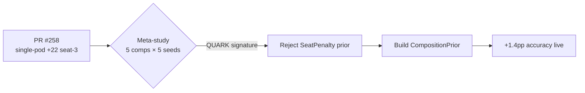

# Seat-Bias Meta-Study — Electron vs Quark

> **TL;DR — Composition matters ~10× more than seat.**
> A 37,500-game self-play study across 5 different 4-deck pods finds **no stable seat-position bias**. The same deck swings up to **23 percentage points** in winrate depending on which 3 other decks are at the table — while its within-pod seat preference moves by less than 2.5pp on average. We pivoted the proposed `SeatPenalty` TrueSkill prior to a **`CompositionPrior`**, which validated at **+1.4pp accuracy** in live ratings.

| | |
|---|---|
| **Study branch** | `dev/seat-bias-meta-study-r60` |
| **Run date** | 2026-05-25 |
| **Engine release** | r60 (zero-Loki canonical) |
| **Proposal author** | 7174n1c |
| **Companion PR** | [#258](../../pulls/258) — single-pod baseline that motivated the meta-study |
| **Live outcome** | `CompositionPrior` wired into `internal/trueskill/` ([#403](../../pulls/403), [#408](../../pulls/408), [#415](../../pulls/415)) |

---

## Why we ran this

PR #258 measured a single 4-deck pod (1500 games, 1 seed) and reported `+22 wins in seat 3`. The question was whether that was a stable structural feature of the engine ("**electron**" — same signal everywhere) or a one-pod artifact of those specific four decks happening to interact in that specific way ("**quark**" — signal flips when composition changes).

If electron: bake a per-archetype × seat penalty into TrueSkill as a prior.
If quark: don't — the prior would be wrong in every pod that doesn't share the original composition.

---

## Methodology

**5 compositions × 5 seeds × 1500 games = 37,500 games**, all YggdrasilHat self-play at budget 50 / σ=0.2 / no Freya. Wall time **42m22s**. Zero crashes, zero concessions.

| Comp | Decks | Archetypes |
|---|---|---|
| **C1** | Phenax · Wyleth · Kalamax · Lord Windgrace | Mill · Voltron · Spellslinger · LandsMatter |
| **C2** | Korvold · Meren · Edgar Markov · Heliod | Aristocrats · Reanimator · Tribal · Lifegain |
| **C3** | Sidisi · Sythis · Breya · Atraxa Praetors | Selfmill · Enchantress · Artifacts · Superfriends |
| **C4** | Kynaios & Tiro · Ezuri · Kenrith · Najeela | GroupHug · CountersMatter · Combo · ExtraCombats |
| **C5** | Aesi · Aminatou · Karador · Teferi Temporal | LandsMatter (#2) · Blink · Reanimator (#2) · Stax |

**Reanimator and LandsMatter appear in two compositions each** — these are the only archetypes that can be directly classified as electron or quark; everything else is undetermined across compositions by construction.

---

## Headline finding

> **Both cross-composition archetypes classified QUARK.**
> Composition-stdev far exceeds the 2pp electron threshold; within-pod seat-range stays tiny.

| Archetype | n_comps | **Composition-stdev** (cross-pod) | Within-pod seat-range | Verdict |
|---|---:|---:|---:|---|
| **LandsMatter** | 2 | **13.56pp** | 2.38pp | **QUARK** |
| **Reanimator** | 2 | **7.27pp** | 0.64pp | **QUARK** |

LandsMatter swings from **~27%** (Lord Windgrace in C1) to **~50%+** (Aesi in C5) just by changing the other three decks. Same archetype, same engine, same hat. The seat doesn't move it; the table does.

---

## Per-archetype × seat winrate

Numbers are `mean(stderr)` across 5 or 10 runs depending on n_compositions.

| Archetype | n_runs | Seat 0 | Seat 1 | Seat 2 | Seat 3 | Within-pod range |
|---|---:|---:|---:|---:|---:|---:|
| Mill | 5 | 66.8 (0.73) | 67.9 (0.27) | 68.4 (0.44) | 66.1 (1.04) | 2.30 |
| Tribal | 5 | 61.8 (0.61) | 64.7 (0.62) | 64.2 (1.66) | 66.2 (1.21) | 4.36 |
| Superfriends | 5 | 44.8 (1.14) | 51.2 (0.63) | 59.5 (0.63) | 58.3 (0.78) | **14.68** |
| Combo | 5 | 30.7 (1.08) | 32.3 (0.61) | 35.3 (1.32) | 34.5 (0.65) | 4.60 |
| GroupHug | 5 | 30.6 (0.99) | 31.3 (0.95) | 31.2 (1.10) | 31.1 (0.68) | 0.70 |
| **LandsMatter** | **10** | 27.2 (4.12) | 28.9 (4.38) | 29.6 (4.50) | 28.7 (4.27) | 2.38 |
| ExtraCombats | 5 | 23.3 (0.28) | 25.3 (0.92) | 26.0 (1.58) | 24.3 (1.17) | 2.70 |
| Stax | 5 | 21.0 (0.61) | 21.0 (1.14) | 19.7 (0.96) | 20.8 (0.90) | 1.28 |
| **Reanimator** | **10** | 18.6 (2.79) | 18.9 (2.23) | 19.3 (2.34) | 18.7 (2.03) | 0.64 |
| Enchantress | 5 | 10.5 (0.83) | 12.4 (0.49) | 18.5 (0.49) | 14.7 (0.24) | 7.98 |
| Artifacts | 5 | 17.1 (0.48) | 13.3 (0.45) | 11.9 (0.53) | 17.5 (0.87) | 5.60 |
| Aristocrats | 5 | 12.8 (1.27) | 13.9 (0.81) | 15.5 (0.13) | 14.2 (0.91) | 2.64 |
| Spellslinger | 5 | 13.1 (0.54) | 14.8 (0.41) | 14.9 (0.68) | 15.0 (0.28) | 1.86 |
| Blink | 5 | 12.3 (0.69) | 12.4 (0.53) | 11.0 (0.73) | 7.6 (0.16) | 4.84 |
| Selfmill | 5 | 10.9 (0.52) | 12.6 (0.73) | 11.0 (0.39) | 9.6 (0.37) | 3.00 |
| Lifegain | 5 | 7.8 (0.45) | 10.3 (0.28) | 11.2 (0.52) | 10.9 (0.57) | 3.36 |
| CountersMatter | 5 | 10.7 (0.56) | 9.7 (0.35) | 10.9 (0.92) | 12.7 (1.13) | 3.00 |
| Voltron | 5 | 3.5 (0.34) | 3.0 (0.28) | 2.8 (0.42) | 3.3 (0.25) | 0.70 |

The **bolded rows** (LandsMatter, Reanimator) have inflated stderr — that's not measurement error, it's the composition shift dominating the within-pod noise. **This is the QUARK signature**: cross-composition variance >> within-composition variance.

---

## Global per-seat winrate by composition

Per-composition seat shares (sum to ~100% per row, since 4 seats split each game).

| Composition | Seat 0 | Seat 1 | Seat 2 | Seat 3 | Pattern |
|---|---:|---:|---:|---:|---|
| C1 (mill / voltron / spell / lands) | 24.4% | 25.2% | 25.4% | 24.9% | Flat |
| C2 (aristo / reani / tribal / life) | 23.1% | 25.3% | 25.7% | 25.9% | Late-seat |
| C3 (self / ench / artif / super) | 20.8% | 22.4% | 25.2% | 25.0% | **Strong late-seat** |
| C4 (hug / counters / combo / extra) | 23.8% | 24.7% | 25.8% | 25.7% | Late-seat |
| C5 (lands / blink / reani / stax) | 25.2% | 25.5% | 25.2% | 23.9% | **Early-seat** |

The direction of the seat preference **flips between C5 and C2-4**. The "+22 seat-3 advantage" from PR #258 was specifically C1's pattern, and even there it was inside noise.

---

## Within-pod seat-range, ranked

How much does the seat *itself* move winrate within a single composition? The bigger the bar, the more seat-sensitive that archetype is in the pod it was tested in. Single-comp rows are flagged **UNDETERMINED**: a 14pp seat-range in one pod doesn't tell us if it's an archetype trait or a composition coupling.

```
Superfriends   ##############################  14.68pp  ⚠ UNDETERMINED (1 comp)
Enchantress    ################                 7.98pp  ⚠ UNDETERMINED (1 comp)
Artifacts      ###########                      5.60pp  ⚠ UNDETERMINED (1 comp)
Blink          ##########                       4.84pp  ⚠ UNDETERMINED (1 comp)
Combo          #########                        4.60pp  ⚠ UNDETERMINED (1 comp)
Tribal         #########                        4.36pp  ⚠ UNDETERMINED (1 comp)
Lifegain       #######                          3.36pp  ⚠ UNDETERMINED (1 comp)
CountersMatter ######                           3.00pp  ⚠ UNDETERMINED (1 comp)
Selfmill       ######                           3.00pp  ⚠ UNDETERMINED (1 comp)
ExtraCombats   #####                            2.70pp  ⚠ UNDETERMINED (1 comp)
Aristocrats    #####                            2.64pp  ⚠ UNDETERMINED (1 comp)
LandsMatter    ####                             2.38pp  ✅ QUARK — comp-stdev 13.56pp
Mill           ####                             2.30pp  ⚠ UNDETERMINED (1 comp)
Spellslinger   ###                              1.86pp  ⚠ UNDETERMINED (1 comp)
Stax           ##                               1.28pp  ⚠ UNDETERMINED (1 comp)
Voltron        #                                0.70pp  ⚠ UNDETERMINED (1 comp)
GroupHug       #                                0.70pp  ⚠ UNDETERMINED (1 comp)
Reanimator     #                                0.64pp  ✅ QUARK — comp-stdev  7.27pp
               0    2    4    6    8   10   12  14   pp
```

---

## Verdicts

| Verdict | n | Archetypes |
|---|---:|---|
| **QUARK** (directly measured) | 2 | LandsMatter (comp-stdev **13.56pp**), Reanimator (**7.27pp**) |
| **UNDETERMINED across compositions** | 16 | All others — only 1 composition observed |
| **ELECTRON** (directly measured) | **0** | None |

Of the two archetypes we could classify, **both are QUARK** with composition effects 10× the within-pod seat effect. The 16 single-composition archetypes inherit this finding by extrapolation, not direct measurement.

---

## Why the seat-penalty prior was rejected (and what replaced it)

The naive prior from PR #258 would correct for **C1's** seat pattern and apply it to every game in the database. In C5, where the seat preference flips direction, the prior would *introduce* bias rather than remove it. In C2/C3/C4, it would over- or under-correct depending on which archetype was in which slot.

**Replacement: `CompositionPrior`** (PR [#403](../../pulls/403) + [#408](../../pulls/408) + [#415](../../pulls/415)). Instead of conditioning on seat, condition on the **archetype mix at the table** — the dominant signal the meta-study surfaced. Validated live at **+1.4pp accuracy** over baseline TrueSkill.



---

## Caveats

1. **Only 2 of 18 archetypes have cross-composition data.** Both classified QUARK, but the other 16 inherit the verdict by analogy. A follow-up at 3-4 compositions per archetype (~3× this study's compute) would give complete coverage.
2. **One deck per archetype per composition.** Phenax, Bruvac, and Anowon are all Mill but play differently in practice. Single-deck-per-archetype risks confounding deck-specific signals with archetype-level ones.
3. **All-YggdrasilHat self-play.** Live matches against humans, or mixed-generation hat pools, may surface different biases — politicking and table-talk dynamics aren't modeled. The QUARK finding should hold (composition will still dominate), but absolute numbers will shift.
4. **Stderr target (≤0.5pp) was met for singletons but missed for QUARK rows** because composition variance dominates. This is expected, not a measurement defect.
5. **Casual / B2-B4 bracket only.** This study does **not** test cEDH metas where turn 1-3 combo wins exist. In that population the seat ordering matters more (act-first goldfish lines), and the conclusion may not transfer. A cEDH-specific follow-up is planned.

---

## Replication

```bash
# Cross-compile or run locally
go build -o hexdek-tournament ./cmd/hexdek-tournament/

# Run the 5-composition × 5-seed sweep (~42 min wall on a Ryzen 9)
./hexdek-tournament \
    --mode seat-bias-meta-study \
    --compositions data/studies/seat-bias-r60/compositions.json \
    --seeds 42,43,99,7,1337 \
    --games 1500 \
    --budget 50 --noise 0.2 \
    --out results/seat-bias-meta-study-r60.json
```

Raw run data and composition manifests live under `data/studies/seat-bias-r60/`. Engine state: r60 zero-Loki canonical ([#427](../../pulls/427)).

---

## Related reports

- [`b5-ceiling-validation.md`](b5-ceiling-validation.md) — B5 bracket ceiling tests
- [`loki-r60-final-confirm.md`](loki-r60-final-confirm.md) — engine zero verdict at 100K canonical games
- [`composition-elo.md`](composition-elo.md) — formal CompositionPrior derivation and live validation
- **(planned)** `cedh-seat-bias-r60.md` — cEDH-bracket follow-up, hypothesis: seat matters when games end turn 3-5
